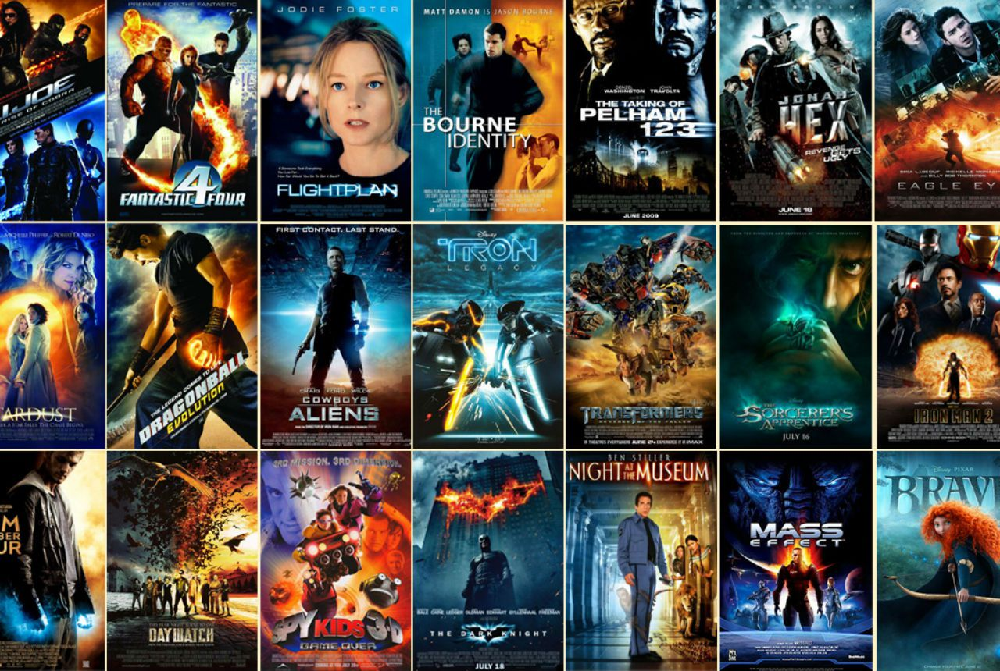

# Film Junky Union: Sentiment Analysis for Movie Reviews

## Project Overview
The Film Junky Union, a community for classic movie enthusiasts, is developing a system for filtering and categorizing movie reviews. The objective of this project was to build and evaluate models to automatically detect negative movie reviews. The target was to achieve an F1 score of at least 0.85 on the test dataset.

## Table of Contents
1. [Introduction](#introduction)
2. [Data Description](#data-description)
3. [Methodology](#methodology)
    - [Exploratory Data Analysis (EDA)](#exploratory-data-analysis-eda)
    - [Modeling](#modeling)
    - [Evaluation](#evaluation)
4. [Results](#results)
5. [Sample Reviews](#sample-reviews)
6. [Conclusion](#conclusion)
7. [Future Work](#future-work)

## Introduction
In this project, I applied advanced natural language processing (NLP) techniques and various machine learning models to develop a sentiment analysis system. The goal was to classify IMDB movie reviews as positive or negative with high accuracy. This project involved extensive feature engineering, model training, and evaluation, with a strong focus on achieving optimal performance metrics.

## Data Description
The dataset used for this project consists of IMDB movie reviews with polarity labeling:
- **review**: The text of the movie review.
- **pos**: The target variable, where '0' indicates a negative review and '1' indicates a positive review.
- **ds_part**: Indicates whether the data belongs to the train or test set.

The dataset was provided by Andrew L. Maas et al. (2011) and is stored in the `imdb_reviews.tsv` file.

## Methodology

### Exploratory Data Analysis (EDA)
An initial EDA was conducted to understand the distribution of reviews and to check for class imbalance. Visualizations and summary statistics were used to guide the preprocessing and modeling steps.

### Modeling
I trained multiple machine learning models including:
- **Logistic Regression**
- **Random Forest**
- **Gradient Boosting (CatBoost, LightGBM, XGBoost)**

Each model was trained using the training dataset, and hyperparameter tuning was conducted to optimize their performance. The models were evaluated using F1 score, precision, recall, and accuracy metrics.

### Evaluation
The models were tested on the test dataset, and their performance was compared. Logistic Regression and CatBoost emerged as the top performers, with F1 scores of 0.8743 and 0.8621, respectively.

## Results
The results of the model evaluations are as follows:
- **Logistic Regression**: F1 Score = 0.8743
- **CatBoost**: F1 Score = 0.8621
- **Random Forest**: F1 Score = 0.8201
- **Gradient Boosting (Other Implementations)**: F1 Scores varied, with some underperforming, likely due to less extensive hyperparameter tuning.

The Logistic Regression model outperformed more complex models, showcasing the effectiveness of simpler models in handling high-dimensional sparse data.

## Sample Reviews
To validate the models, I classified several sample reviews:

1. **Review**: "I absolutely loved this movie! The plot was thrilling and the characters were well developed."
    - **Logistic Regression**: Positive
    - **Random Forest**: Positive
    - **Gradient Boosting**: Positive

2. **Review**: "The movie was terrible. The plot made no sense and the acting was awful."
    - **Logistic Regression**: Negative
    - **Random Forest**: Negative
    - **Gradient Boosting**: Negative

3. **Review**: "An average movie. Some parts were good, but overall it was just okay."
    - **Logistic Regression**: Negative
    - **Random Forest**: Negative
    - **Gradient Boosting**: Positive

The sample analysis showed consistent results across Logistic Regression and Random Forest, with a slight discrepancy in the Gradient Boosting model.

## Conclusion
In conclusion, this project demonstrated the effectiveness of combining NLP techniques with machine learning models for sentiment analysis. The Logistic Regression model, despite its simplicity, outperformed more complex models, highlighting its robustness in handling sparse text data. The project achieved its goal with a top F1 score of 0.8743, exceeding the required threshold.

## Future Work
Future enhancements could include:
- Exploring deep learning models such as BERT for even better performance.
- Conducting more extensive hyperparameter tuning for ensemble models.
- Integrating additional features or external data sources for improved accuracy.

This project showcases my ability to apply machine learning to real-world problems, with a focus on model optimization and feature engineering. It also demonstrates my capability in working with text data, conducting thorough evaluations, and presenting clear, actionable insights.

---

### Contact Information
- **GitHub**: [Oliver Worth](https://github.com/oliver-worth)
